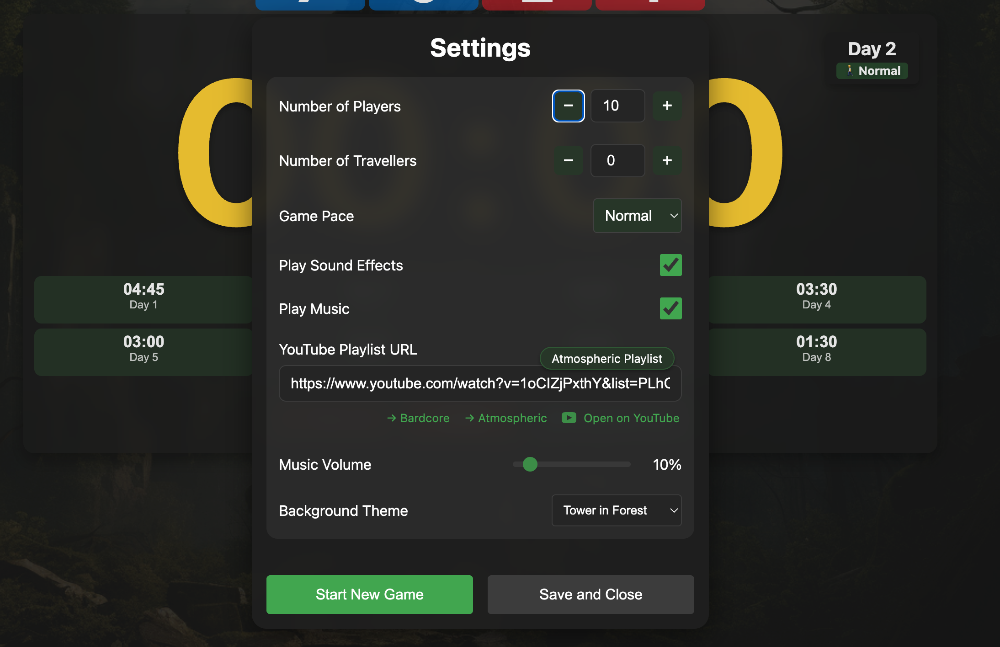

# (Yet Another) Clocktower Timer


## Finding It

Simply visit
[https://timer.arcane-scripts.net](https://timer.arcane-scripts.net)
to use this timer.

## Features

### Core Timer Features

- Basic countdown functionality
- Pause/Resume capability
- Reset functionality
- Fullscreen mode

### Game Day Management

- Day tracking (Day 1 through N)
- Automatic day progression
- Day state indicators (Dawn/Normal/Dusk)
- "Wake Up" transition between days
- Short countdown (10 seconds) when waking up

### Player Count Features

- Support for 5-15 players
- Automatic timer duration calculation based on player count
- Character distribution display (Townsfolk/Outsider/Minion/Demon)
- Traveller count support (0-5)

### Game Pace Settings

- Three pace options: Relaxed, Normal, Speedy
- Automatic timer adjustment based on pace
- Visual indicators for current pace (🐢/🚶/⚡)

### Timer Presets

- Dynamic day presets based on player count
- Automatic time scaling for different game paces
- Visual highlighting of current day's preset

### Sound Features

- Wake up bell sound
- End of day bell sound
- Fallback beep sound if audio files fail to load
- Toggleable sound effects

### Music Integration

- YouTube playlist support
- Custom playlist URL support
- Volume control
- Auto-pause/resume with timer
- Playlist shuffling
- Offline mode handling

### Visual Features

- Large, clear timer display
- Day/Dawn/Dusk state indicators
- Theme support (medieval-cartoon and others)
- Button state management
- Progress indicator for accelerate button

### Special Functions

- "Accelerate Time" feature (hold-to-activate)
- Wake Lock to prevent device sleep
- QR code generation for sharing
- Settings persistence (localStorage)

### UI/UX Features

- Settings dialog
- Info dialog
- Keyboard shortcuts (e.g., 'Q' for settings)
- Responsive design
- Clear button states and labels
- First-time user onboarding

### Technical Features

- Offline capability
- Error handling for audio and YouTube
- Device wake lock
- Local storage for settings
- No build requirements (pure HTML/CSS/JavaScript)

## Settings Dialog



## Development

This is a pure HTML/CSS/JavaScript application with no build requirements. To run
locally:

```bash
python3 -m http.server
```

Then visit `http://localhost:8000` in your browser.
