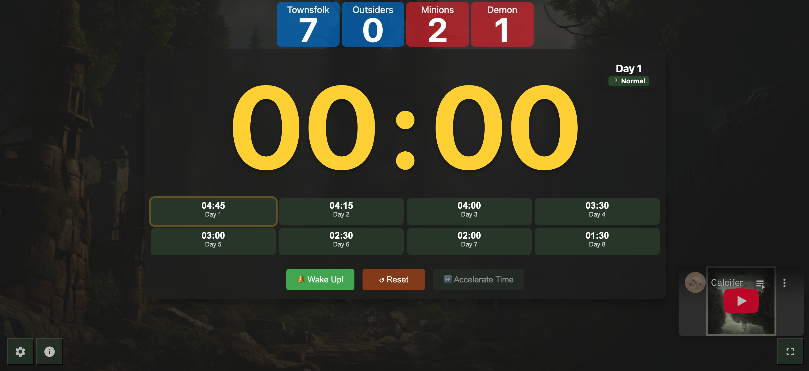

# Quick Timer

A simple, elegant countdown timer with a clean interface. Perfect for timing breaks,
presentations, or any timed activity.



## Features

- Large, easy-to-read display
- Quick minute presets (0-10 minutes)
- Second presets (0, 15, 30, 45 seconds)
- Sound notification when timer ends
- Pause and reset functionality
- Dark theme with customizable background
- Mobile-friendly design

## Usage

1. Select minutes (0-10)
2. Select seconds (00, 15, 30, 45)
3. Click Start to begin countdown
4. Use Pause to temporarily stop
5. Use Reset to clear timer

## Development

This is a pure HTML/CSS/JavaScript application with no build requirements. To run
locally:

```bash
python3 -m http.server
```

Then visit `http://localhost:8000` in your browser.
