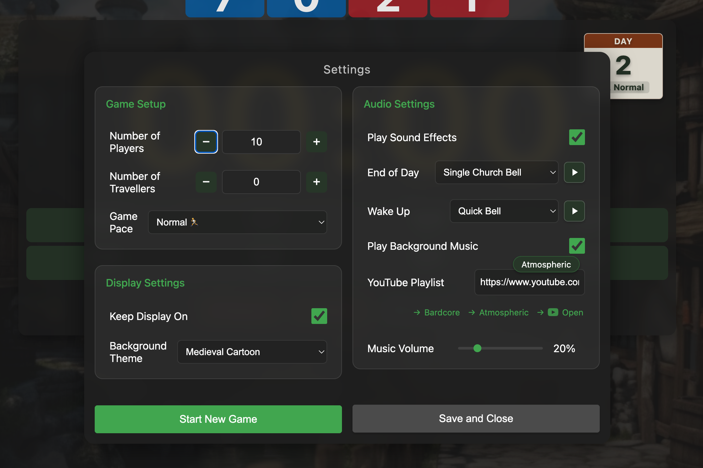

# (Yet Another) Clocktower Timer


## Finding It

Simply visit
[https://chizmw.github.io/clocktowertimer/](https://chizmw.github.io/clocktowertimer/)
to use this timer.

## Features

- preset timer values based on player count
- change your game pace to suit the session (Relaxed, Normal, Speedy)
- quickly run down the timer with "Accelerate Time"
- character distribution shown above the timer
- keep track of the current day:
  - Settings » Start New Game
  - use the Day 1 preset after Night 1
  - use Wake Up to transition from Night to Day
    - this will automatically increment the day and start the next timer

## Settings Dialog



## Development

This is a pure HTML/CSS/JavaScript application with no build requirements. To run
locally:

```bash
python3 -m http.server
```

Then visit `http://localhost:8000` in your browser.
